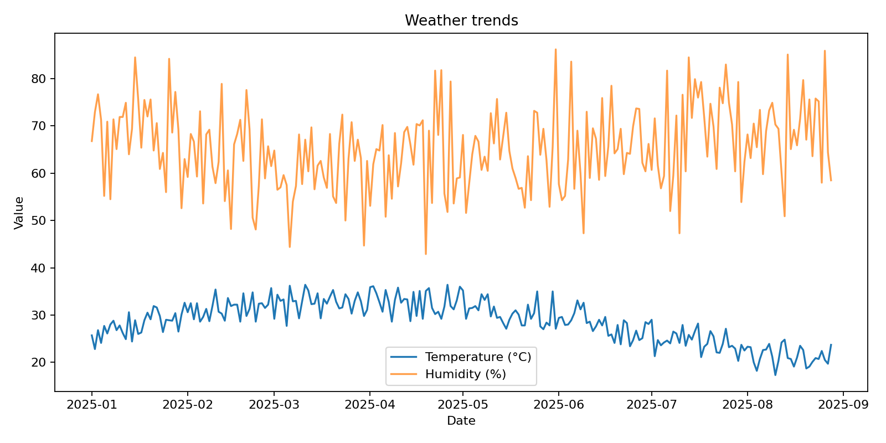
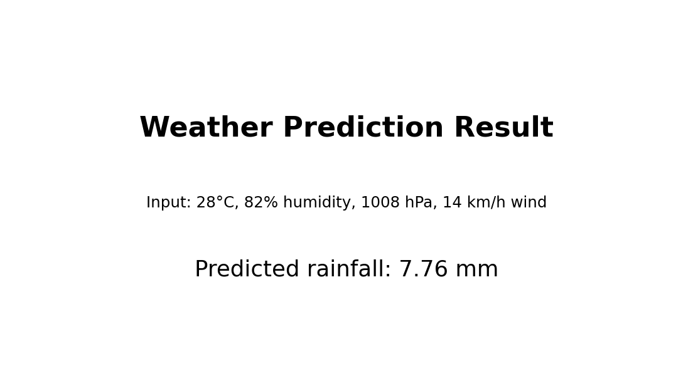

# Weather Prediction with Machine Learning

A reproducible machine-learning project that predicts rainfall in millimetres from temperature, humidity, atmospheric pressure and wind speed. The project includes data exploration, model training, command-line prediction and visualisation.

[](https://yashraj-weather-prediction-ml.streamlit.app)

## What the project does

- Loads and validates an included weather dataset
- Trains a `RandomForestRegressor`
- Evaluates the model using MAE and R²
- Saves the trained model for later predictions
- Accepts new weather values from the command line
- Provides an interactive Streamlit prediction dashboard
- Produces a weather-trends chart

## Live demo

Try the deployed application: **[Weather Prediction ML App](https://yashraj-weather-prediction-ml.streamlit.app)**

## Model results

Results from the included 240-row sample dataset using `random_state=42`:

| Metric | Result |
|---|---:|
| Mean Absolute Error | 3.14 mm |
| R² score | 0.442 |

These results are a learning baseline on a small demonstration dataset, not a production weather forecast.

## Screenshots





## Project structure

```text
Weather-Prediction-ML/
├── app.py                      # Interactive Streamlit application
├── sample_weather.csv          # Demonstration dataset
├── train_model.py              # Training and evaluation pipeline
├── predict.py                  # Command-line rainfall prediction
├── visualize_data.py           # Dataset visualisation
├── weather_prediction.ipynb    # Exploration notebook
├── weather_model.joblib        # Trained model bundle
├── weather_trends.png          # Generated chart
├── prediction_result.png       # Example output
├── MODEL_CARD.md               # Model scope, metrics and limitations
├── requirements.txt            # App and model dependencies
└── requirements-dev.txt        # Notebook and visualisation tools
```

## Installation

```bash
git clone https://github.com/yashrajadsul165/Weather-Prediction-ML.git
cd Weather-Prediction-ML
python -m venv .venv
```

Activate the environment on Windows:

```bash
.venv\Scripts\activate
```

Install the app and model dependencies:

```bash
pip install -r requirements.txt
```

For notebook and chart development, install the additional tools:

```bash
pip install -r requirements-dev.txt
```

## Interactive application

Train the model once, then launch the dashboard:

```bash
python train_model.py
streamlit run app.py
```

The app provides validated weather inputs, an instant rainfall estimate and clear model-limitations guidance.

## Command-line usage

Train and evaluate the model:

```bash
python train_model.py
```

Make a prediction:

```bash
python predict.py --temperature 28 --humidity 75 --pressure 1012 --wind-speed 10
```

Create the trends chart:

```bash
python visualize_data.py
```

Open the notebook:

```bash
jupyter notebook weather_prediction.ipynb
```

## Dataset fields

| Column | Meaning |
|---|---|
| `date` | Observation date |
| `temperature_c` | Temperature in °C |
| `humidity_pct` | Relative humidity in percent |
| `pressure_hpa` | Atmospheric pressure in hPa |
| `wind_speed_kmh` | Wind speed in km/h |
| `rainfall_mm` | Rainfall target in millimetres |

## Future improvements

- Train on a larger verified meteorological dataset
- Compare multiple regression models
- Use time-aware validation and feature engineering
- Add live weather API data
- Add live meteorological data and automated model monitoring

## Author

**Yashraj Adsul**

[LinkedIn](https://www.linkedin.com/in/yashraj-adsul) · [Email](mailto:yashrajadsul165@gmail.com)

## License

This project is available under the [MIT License](LICENSE).

